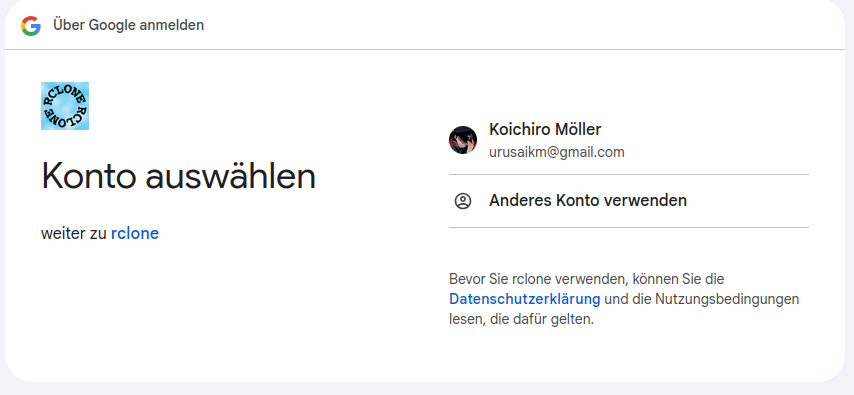

# M143

## Projektbeschreibung

Ich hatte viele Probleme und das Projekt vorher hat nicht mit den Kriterien vorne übereingestummen. Deshalb habe ich beschlossen von vorne anzufangen. Ich musste mich leider in der letzen Woche noch auf ein anderes Projekt wechseln, deshalb hatte ich eine Menge Stress. Ich hatte mir etwas einfaches überlegt das ich schaffen sollte. Erstens ein einfaches Backup von einem Folder in einer VM. Es backupt den Ordner auf einen google drive und es synct automatisch mit einem Cronjob. Zusätzlich Sollte ich die VM von überall öffnen können und die Vm sollte auch Backupt werden. 

## Informieren

Wie bereits erwähnt habe ich mich am Anfang nicht sehr gut informiert wenn es um Lernziele geht, deshalb musste ich das Projekt in der letzten Woche noch ändern. Ich wollte etwas nützliches machen das einen Sinn hat. Und mit der wenigen Zeit die ich noch übrig hatte wollte ich nicht zu hohe Ziele setzen.
Ich habe mir überlegt etwas mit einer VM zu machen. Danach habe ich mir überlegt einen Ordner Backup erstellen. Am besten sollte es auch von verschiedenen Geräten möglich sein. Deshalb hatte ich vor RDP auf der VM einzurichten. Ich informierte mich über die VMs als erstes um zu sehen welche am besten sind. Hier ist ein kleiner vergleich von Chat gpt
#### Hypervisors

Hier habe ich mich für Oracle entschieden, denn ich kannte das bereits von Modulen vorher gekannt.

#### Cloud Plattformen

Hier war die Wahl auch wieder Google Drive, weil ich es von früher schon ein ganz wenig kannte. 

#### Remote Zugriff

Bei Remote Zugriff kannte ich nur SSH aber ich wollte nicht in einer Terminal Umgebung arbeiten deshalb habe ich mich für xrdp entschieden. Hier musste ich mich am meisten reinlernen da ich es noch gar nicht verstanden habe. 

#### Zusätzliche Downloades
Ich musste in der Linux VM sehr viele kleine Applikationen herunterladen. Viele davon waren für den Remote Zugriff. 

## Planen
Ich hatte nicht viel Zeit zu planen da ich sowieso nur sehr wenig Zeit hatte. Das planen hätte mir mehr zeit genommen als es mir gespart hätte, deshalb habe ich diesen Schritt meisten Teils übersprungen. 

## Entscheiden
Die erste Entscheidung die ich treffen musste ist natürlich was für ein Projekt ich machen will. Ich dachte mir natürlich ich will etwas nütliches machen denn ich bin einiges motivierter wenn ich an einem nützlichen Projekt arbeite. Ausserderm hatte ich nicht mehr viel Zeit deshalb hatte ich mich entschieden lieber etwas machen das ich in dieser kurzen Zeit schaffen werde. Ich entschied mich für ein kleines Folder Backup Projekt, dass in einer VM ist auf der ich von anderen Geräten über Remote Desktop Connection zugreiffen kann. 
Ich musste ein paar Entscheidungen treffen die ich vorallem nach dem informieren machte, wo ich die Applikationen wählte. 

## Realisieren
Dieser Teil ging natürlich am längsten. Ich fing an mit dem erstellen der Ubuntu VM. Ich hatte bereits ein Ubuntu ISO File und ich wusste schon wie man eine VM erstellt. Als das aufgesetzt war habe ich mich direkt rangemacht mit dem Backup. Ich habe angefangen mit dem Folder erstellen. Ich habe es simple Backup gennant und danach schonmal Ordner in den Google Drive gemacht. Diesen nannte ich backup-folder. Die IP bei der VM ist so

192.168.88.100 Habe ich genommen.

#### Backup 
Diese Art von Backup ist immer nützlich den es ist einfach ein Ordner der nicht verloren gehen kann. Im privaten ist es auch nützlich für sichere Daten.

Um das zu machen habe ich als erstens Rclone installiert mit dem Command "sudo apt install rclone"
Danach habe ich mit "rclone config" ausgeführt. So sieht das dann aus:

Man sieht alle Remotes die man hat und die alle auswahlen die man machen kann. Um ein neue Remote zu erstellen für das Backup nimmt man wie man sieht "n" für new remote. Dann muss man den Namen für die Remote eingeben. Es kommt dann eine riesige Liste von Typen von Speicher. Ich musste 20 eingeben für Google Drive. Anschliessend kommt das: 

Bei diesen zwei Schritten kann man einfach Enter drücken ohne Eingabe. Dann kann man den Zugriff auswählen der rclone hat wenn es Zugriff von der Drive anfragt. 

Es sollte dann ein Browser Fenster öffnen mit rclone das anfragt mit welchem google Account man sch anmelden will.

Danach fragt es für Zugriff auf das Konto für die Verbindung. 
Es sollte danach synced sein und sollte eine Verbindung haben. 
Anschliessend habe ich das getestet indem ich in den Backup Folder in der VM ein Textfile. 

Dies habe ich mit einem simplen Command gemacht
"rclone sync /home/koichiro/Documents/Backup gdrive:/backup-folder --progress", da ich das automatische syncen noch nicht erstellt habe. 

#### Cronjob für automatisch syncen 
Ich hatte hier ein bisschen mehr mühe da ich es am Anfang noch nicht gut verstand. Ich habe erst mal einfach mit einen Crontab mit "crontab -e" geöffnet. Wichtig war das ich es nicht beim starten der VM immer manual ausführen muss. Dafür habe ich "@reboot /home/koichiro/auto-sync.sh" in das Script eingefügt. Das ich weiss das es funktioniert habe ich ob der Cronjob aktiv ist. 
Das sieht man mit "crontab -1". 
Ab diesem Schritt habe ich Hilfe von Chat gpt genommen. Ich habe eine Systemd-Service-Datei erstellt mit "sudo nano /etc/systemd/system/sync-to-gdrive.service" Dann in das File habe ich 

#### Dieses Script ist ein Beispiel von Chat GPT
[Unit]
Description=Sync Backup to Google Drive
After=network.target

[Service]
ExecStart=/home/koichiro/sync-to-gdrive.sh
Restart=always
User=koichiro

[Install]
WantedBy=multi-user.target
 eingefügt 

Dann speichern mit CTRL + o und exit mit CTRL + x. Es sollte gestartet werden mit 
* "sudo systemctl enable sync-to-gdrive.service"

und 
* "sudo systemctl start sync-to-gdrive.service"

Es sollte dann immer die Datein im Backup Ordner in den Google Drive Ordner backupen. 

#### Remote Desktop Connection

Ich hatte zuerst vor mich mit ssh zu verbinden jedoch muss man da in einer Terminal mässigen Umbgebung arbeiten, was mir nicht gefällt. Deshalb habe ich gesucht nach andere möglichkeiten zum verbinden zur VM. Ich habe mich für XRDP entschieden da es sich relativ simple angehört hatte. Ich habe es installiert auf meiner VM mit "sudo apt install xrdp -y". Danach musste ich ein Desktop-Enviroment installieren. Da hat es mir XFCE empfohlen. 
Ich habe es mir heruntergeladen mit "sudo apt install xfce4 xfce4-goodies -y" und gestartet mit "sudo systemctl enable --now xrdp"

Ich musste dann XRDP durch die Firewall lassen über den Port 3389. Anschliessend die IP der VM herausfinden mit "ip a". Danach kann man sich von einem andere Gerät mit RDP verbinden. 

#### Manual
Bei Meinem Projekt ist es sehr einfach gehalten und sobald man ein File in den Ordner macht wird es im Google Drive Ordner erscheinen. Für die Remote Desktop Connection muss man bei Windows einfach RDP suchen und die Applikation öffnen. Da kann man die IP eingeben und wenn das gemacht ist sollte sich ein neues Fenster öffnen mit einem anmeldeformular mässigen Feld. Dort kommt der Username auf der VM rein und das Passwort. 
Dann öffnet sich ein PC in dem Fall eine Ubuntu VM.

Dies ist bei meinem Projekt nicht schwierig da ich nur einen Ordner Backupe. Mann kann den Ordner schnell von Google Drive in eine neu erstellte oder andere VM kopieren und dann die paar Scripts zum syncen ausführen und schon hat man das Backup wieder.

## Probleme

### 1. 
Das erste Problem bei mir hatte etwas mit den VMs zu tun. 
Es hatte sehr komisch Tastaturverzögerung und hat nicht richtig geschrieben. Die VM ist auch gecrasht und man konnte nichts mehr bewegen. 

Die Lösung: Die Lösung war ganz einfach und ich bin mir ziemlich sicher es war ein RAM Problem. Ich gab der VM zu wenig RAM für den Anfang.
### 2.

Das zweite Problem hatte ich mit den Cronjobs. Es hat sie meistens als aktiv angezeigt aber hat leider nichts ausgeführt. 

Die Lösung: Es war ganz einfach das Skript hatte nicht genug Berechtigung eifach diesen Command ausgeführt 
"chmod +x /path/to/script.sh"

### 3. 
Da hatte ich die meisten Probleme. Es geht um das Remote Desktop Connection. Wenn ich mich verbunden habe, hatte es ein kleines Anmeldefenster. Wenn ich die Anmeldedaten eingegeben habe war nur ein Blackscreen. Ich habe sehr viel verschiedenes ausprobiert jedoch hat nichts funktioniert. Ich habe geschaut ob die Firewall die Ports blockiert oder ich fehlende Benutzterrechte hatte.
Ich habe es auch mehrere mals deinstalliert und wieder installiert. 

Lösung: Ich habe danach die Logs an Chat GPT geschickt und er hat mich gesagt ich solle ein richtiges Startskript für die Desktop Umgebung setzen. Danach hat es zum glück funktioniert auch wenn es ein bisschen langsam war.

## Kontrollieren

Natürlich habe ich als erstes kontrolliert ob die Files überhaupt in der Google Drive landen. 
So sah es aus in der Drive:

und in der VM sah es so aus:

Ich konnte ausserdem von meinem Windows PC mit rdp auf die ubuntu VM gehen. So sah es aus:

## Auswertung

Ich habe mich leider am Anfang nicht gut genug informtiert und geplant desshalb hatte ich dieses grosse Problem am Ende. Ich musste das Projekt noch in den letztn paar Tagen machen, was ein grosser Stress war. Nächstes Projekt werde ich mich definitiv besser informieren. Ich werde die Ziele genauer anschauen und meine Zeit besser planen. Ich bin froh das ich das kleine Projekt das ich mir vorgenommen habe noch fertig geschafft habe. Auch wenn ich nur ein kleines Projekt gemacht habe, habe ich sehr viel gelernt was ich gut fand. Ich habe relativ viel gelernt wenns um backups geht während dem Arbeiten. Ich bin schlussendlich zufrieden was ich gemacht und gelernt habe mit dem rest der Zeit gemacht habe. Ich hoffe ich kann das gelernte in meinem nächsten Projekt verwenden und nicht so einen Fehler machen.

