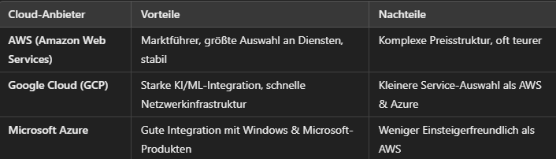

# M143

## Projektbeschreibung

Ich hatte viele Probleme und das Projekt vorher hat nicht mit den Kriterien vorne übereingestummen. Deshalb habe ich beschlossen von vorne anzufangen. Ich musste mich leider in der letzen Woche noch auf ein anderes Projekt wechseln, deshalb hatte ich eine Menge Stress. Ich hatte mir etwas einfaches überlegt das ich schaffen sollte. Erstens ein einfaches Backup von einem Folder in einer VM. Es backupt den Ordner auf einen google drive und es synct automatisch mit einem Cronjob. Zusätzlich Sollte ich die VM von überall öffnen können und die Vm sollte auch Backupt werden.

## Informieren

Wie bereits erwähnt habe ich mich am Anfang nicht sehr gut informiert wenn es um Lernziele geht, deshalb musste ich das Projekt in der letzten Woche noch ändern. Ich wollte etwas nützliches machen das einen Sinn hat. Und mit der wenigen Zeit die ich noch übrig hatte wollte ich nicht zu hohe Ziele setzen.
Ich habe mir überlegt etwas mit einer VM zu machen. Danach habe ich mir überlegt einen Ordner Backup erstellen. Am besten sollte es auch von verschiedenen Geräten möglich sein. Deshalb hatte ich vor RDP auf der VM einzurichten. Ich informierte mich über die VMs als erstes um zu sehen welche am besten sind. Hier ist ein kleiner vergleich von Chat gpt
#### Hypervisors

Hier habe ich mich für Oracle entschieden, denn ich kannte das bereits von Modulen vorher gekannt.

#### Cloud Plattformen

Hier war die Wahl auch wieder Google Drive, weil ich es von früher schon ein ganz wenig kannte. 

#### Remote Zugriff

Bei Remote Zugriff kannte ich nur SSH aber ich wollte nicht in einer Terminal Umgebung arbeiten deshalb habe ich mich für xrdp entschieden. Hier musste ich mich am meisten reinlernen da ich es noch gar nicht verstanden habe. 

#### Zusätzliche Downloades
Ich musste in der Linux VM sehr viele kleine Applikationen herunterladen. Viele davon waren für den Remote Zugriff. 

## Planen
Ich hatte nicht viel Zeit zu planen da ich sowieso nur sehr wenig Zeit hatte. Das planen hätte mir mehr zeit genommen als es mir gespart hätte, deshalb habe ich diesen Schritt meisten Teils übersprungen.

## Entscheiden
Die erste Entscheidung die ich treffen musste ist natürlich was für ein Projekt ich machen will. Ich dachte mir natürlich ich will etwas nütliches machen denn ich bin einiges motivierter wenn ich an einem nützlichen Projekt arbeite. Ausserderm hatte ich nicht mehr viel Zeit deshalb hatte ich mich entschieden lieber etwas machen das ich in dieser kurzen Zeit schaffen werde. Ich entschied mich für ein kleines Folder Backup Projekt, dass in einer VM ist auf der ich von anderen Geräten über Remote Desktop Connection zugreiffen kann. 
Ich musste ein paar Entscheidungen treffen die ich vorallem nach dem informieren machte, wo ich die Applikationen wählte. 

## Realisieren
Dieser Teil ging natürlich am längsten. Ich fing an mit dem erstellen der Ubuntu VM. Ich hatte bereits ein Ubuntu ISO File und ich wusste schon wie man eine VM erstellt. Als das aufgesetzt war habe ich mich direkt rangemacht mit dem Backup. Ich habe angefangen mit dem Folder erstellen. Ich habe es simple Backup gennant und danach schonmal Ordner in den Google Drive gemacht. Diesen nannte ich backup-folder. 

 

In diesem Bild sieht man bereits mein Testfile ob der Ordner in der VM und Google Drive synchronisiert sind. Bis das funktioniert hat es zum Glück nicht sehr lange gedauert. 

#### Backup 
Um das zu machen habe ich als erstens Rclone installiert mit dem Command "sudo apt install rclone"
Danach habe ich mit "rclone config" ausgeführt. So sieht das dann aus:

Man sieht alle Remotes die man hat und die alle auswahlen die man machen kann. Um ein neue Remote zu erstellen für das Backup nimmt man wie man sieht "n" für new remote. Dann muss man den Namen für die Remote eingeben. Es kommt dann eine riesige Liste von Typen von Speicher. Ich musste 20 eingeben für Google Drive. Anschliessend kommt das: 

Bei diesen zwei Schritten kann man einfach Enter drücken ohne Eingabe. Dann kann man den Zugriff auswählen der rclone hat wenn es Zugriff von der Drive anfragt. 

Es sollte dann ein Browser Fenster öffnen mit rclone das anfragt mit welchem google Account man sch anmelden will.

Danach fragt es für Zugriff auf das Konto für die verbindung. 